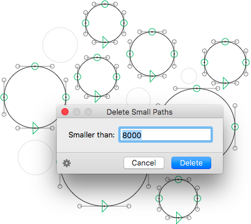

# DeleteSmallPaths.glyphsFilter

*Filter > Delete Small Paths* is a plugin for the [Glyphs font editor](http://glyphsapp.com/). It deletes all paths smaller than a threshold value in square units. It can be useful for cleaning up glyphs from vector debris.

### Installation

1. Go to *Window > Plugin Manager.*
2. Look for *Delete Small Paths*, and click the *Install* button next to it.
3. Restart Glyphs.

### Usage Instructions

1. Open a glyph in Edit View, or select any number of glyphs in Font or Edit View.
2. Use *Filter > Delete Small Paths* to bring up the dialog and enter a threshold value.

Or use it as a custom parameter in an instance:

	Property: Filter
	Value: DeleteSmallPaths; smallerthan:<threshold>

E.g.:

	DeleteSmallPaths; smallerthan:2500

If you do not feel like typing it, you can choose *Copy Custom Parameter* from the gear menu, which puts the custom parameter with the current dialog settings in the clipboard. You can then paste it into an instance parameter field.

### Requirements

The plugin needs Glyphs 2.3 or higher, running on OS X 10.9 or later.

### License

Copyright 2016 Rainer Erich Scheichelbauer (@mekkablue).
Based on sample code by Georg Seifert (@schriftgestalt) and Jan Gerner (@yanone).

Licensed under the Apache License, Version 2.0 (the "License");
you may not use this file except in compliance with the License.
You may obtain a copy of the License at

http://www.apache.org/licenses/LICENSE-2.0

See the License file included in this repository for further details.
